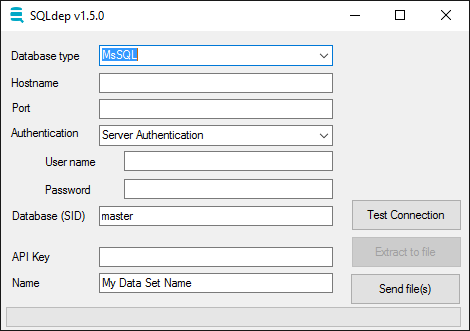

# lionfish
Windows GUI app to export database structure to SQLdep

## What does it do?

The utility exports all

- CREATE TABLE ...
- CREATE VIEW ...
- CREATE PROCEDURE ...
- CREATE SYNONYM ...
- CREATE LINK ...

statements into a file. Optionally the utility allows you to
send data directly to SQLdep.com under your Account Id.

## How to use

1. select Database and Driver
1. fill in Username, Password and Database fields
1. fill in your userAccountId (or Key) you got by email or from sqldep.com
1. click on `Test Connection`
1. fill in the name of your export
1. click on `Extract to file` and wait for it to finish (might take some time)
1. (optional) click on `Send data to SQLdep.com`

## What will it do to my database?

The utility will run SELECT statements located under `/sql` directory.
These SELECTs pull data out of DB catalog or dictionary. No temporary
tables are created during this process.

If you are concerned about safety you can even check the source code written
in C#.

https://github.com/sqldep/lionfish

## How to limit what is being exported?

After unpacking SQLdep.zip you will find an `sql` directory which contains all SQL code being executed by Lionfish. It is possible to edit these files as follows.

##### MS SQL - only export some databases
1. open file `sql/mssql/databases/cmd.sql`
2. find, uncomment and edit this statement:
```sql
AND d.name IN ('db_to_export')
```

##### MS SQL - only export some views/tables
1. open file `sql/mssql/queries/cmd.sql`
2. uncomment and edit this statement
```sql
WHERE v.name IN ('view_to_export')
```

##### MS SQL - only export some procedures
1. open file `sql/mssql/queries/cmd.sql`
2. uncomment and edit this statement
```sql
WHERE p.name IN ('procedure_to_export')
```

##### Oracle - only export some schemas
1. open file `sql/oracle/databases/cmd.sql`
2. uncomment and edit at all 3 places
```sql
AND src.OWNER IN ('schema_to _export')
```

```sql
AND v.OWNER IN ('schema_to _export')
```

```sql
AND mv.OWNER IN ('schema_to _export')
```

##### Oracle - only export some views
1. open file `sql/oracle/queries/cmd.sql`
2. uncomment and edit at these 2 places:
```sql
AND v.VIEW_NAME IN ('view_to _export')
```
```sql
AND mv.VIEW_NAME IN ('view_to _export')
```

##### Oracle - only export some procedures
1. open file `sql/oracle/queries/cmd.sql`
2. uncomment and edit this section
```sql
AND src.NAME IN ('procedure_to _export')
```

##### Teradata - only export some databases
1. open file `sql/teradata/databases/cmd.sql`
2. uncomment and edit following section
```sql
AND databasename IN ('db_to_export')
```

##### Teradata - only export some views
1. open file `sql/teradata/tables/cmd.sql`
2. find and edit all 3! occurencies of:
```sql
AND tablename IN ('view_to_export', 'table_to_export')
```

## Scheduling Exports

Since version 1.5.0. it is possible to use SQLDepCmd.exe to
schedule exports. See `export.bat` file for an example
batch file that exports 3 databases and sends them off
at once.

SQLDepCmd.exe is the command line interface to Lionfish
with these parameters:

```shell
Options:
      --dbType=VALUE         database type: mssql|oracle|teradata
  -a, --auth=VALUE           authorization (default is sql_auth): sql_auth|win_auth
  -s, --server=VALUE         server name or hostname
  -p, --port=VALUE           port
  -d, --database=VALUE       database (SID for Oracle)
  -u, --user=VALUE           loginName
      --pwd, --password=VALUE
                             password
  -n, --name=VALUE           custom name of export
  -f, --file=VALUE           output file
  -k, --key=VALUE            api key (Guid)
  -h, --help                 show help
      --send=VALUE           SEND or SENDONLY, if omitted nothing is sent
```

## Troubleshooting

Check the log file `SQLdepLog.txt` for detailed information.
Bugs can be reported at https://github.com/sqldep/lionfish/issues
or via form at http://www.sqldep.com.

Please attach relevant parts of log.
